# Code-Apric


A lightweight, browser-based IDE built with **Node.js**, **CodeMirror 6**, and **xterm.js**. Code-Apric provides a VS Code–like experience directly in the browser, allowing users to manage files, edit code with syntax highlighting, preview web content, and compile or run multiple programming languages.

---

## Screenshots

> 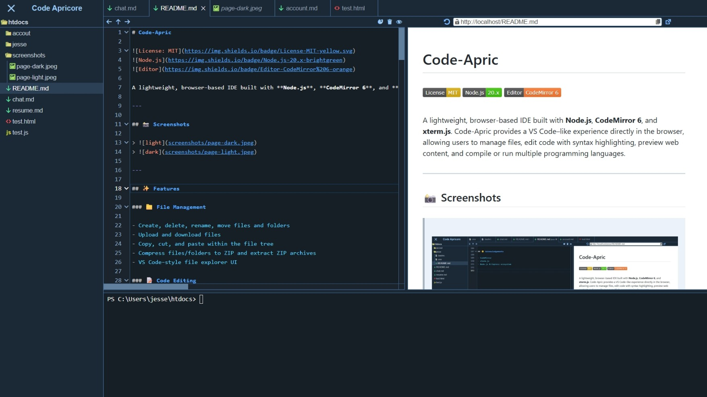
> 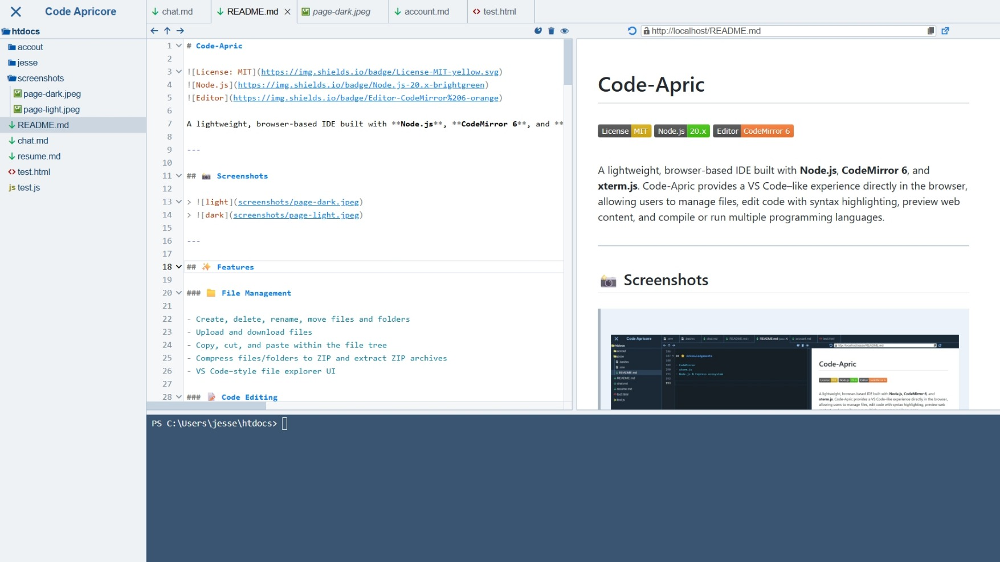

---

## Features

### File Management

- Create, delete, rename, move files and folders
- Upload and download files
- Copy, cut, and paste within the file tree
- Compress files/folders to ZIP and extract ZIP archives
- VS Code–style file explorer UI

### Code Editing

- Powered by **CodeMirror 6**
- Syntax highlighting for:
  - HTML, CSS, JavaScript, JSON
  - C, C++, Python, Java
  - Markdown, PHP, SQL, XML

### Run & Preview Code

#### Web Languages

- HTML / CSS / JavaScript
- Markdown (rendered via `marked`)
- Live preview in an embedded **iframe** served by the Node.js backend

#### Compiled / Scripted Languages

- Embedded **xterm.js** terminal
- Automatic execution on save:
  - **C**: `gcc filename.c`
  - **C++**: `g++ filename.cpp`
- Ctrl-R to run:
  - **C\C++**: `./a.exe`
  - **Python**: `python filename.py`
  - **Java**: `java filename.java`

> Uses `node-pty` to provide a real pseudo-terminal on supported platforms.

---

## Tech Stack

### Frontend

- CodeMirror 6 (editor & language support)
- xterm.js (terminal emulator)
- Custom UI components (VS Code–inspired)

### Backend

- Node.js
- Express 5
- WebSocket (`ws`) for real-time communication
- File system utilities and ZIP handling (`adm-zip`)

### Tooling

- esbuild (client bundling)
- nodemon (development)

---

## Notes & Limitations

- Code execution runs **on the server machine**. Do **not** expose this publicly without proper sandboxing.
- `node-pty` is optional and platform-dependent. Terminal execution may be limited if unavailable.
- This project is intended for **learning, experimentation, or controlled environments**.

---

## License

This project is licensed under the **MIT License**.

You are free to use, modify, distribute, and sublicense this software, provided that the original copyright notice and license text are included in all copies or substantial portions of the software.

See the `LICENSE` file for full license text.

---

## Getting Started

### Prerequisites

- Node.js (v20+ recommended)
- GCC / G++ (for C/C++)
- Python
- Java (JDK)

Make sure the above compilers/interpreters are available in your system `PATH`.

### Installation

1. **Clone the repository:**
   ```bash
   git clone https://github.com/apricore/code-apric.git
   cd code-apric
   ```

2. **Install node_modules:**
   ```bash
   npm install --omit=dev
   ```
### Start the Server

  - **Usage:**
    ```bash
    npm start <foldername> <port>
    ```

  - **Example:**
    ```bash
    npm start ../htdocs 80
    ```

## Instructions

- **Create file (`Ctrl-N` if installed as an app):**  
  1. Right click the root folder and on the context menu click "New File":  
  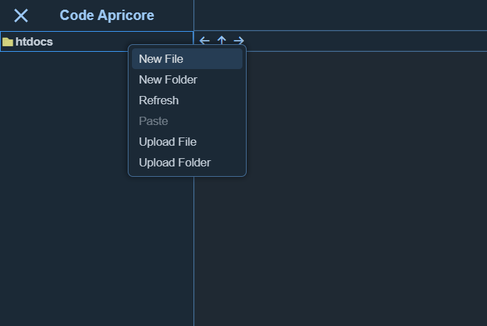
  2. Enter a file name and press the Enter key:  
  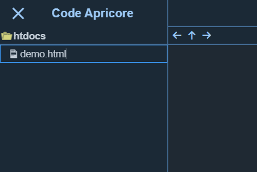
  
- **`Ctrl-S` to save file:**
  3. Edit the file and press Ctrl-S to save:  
  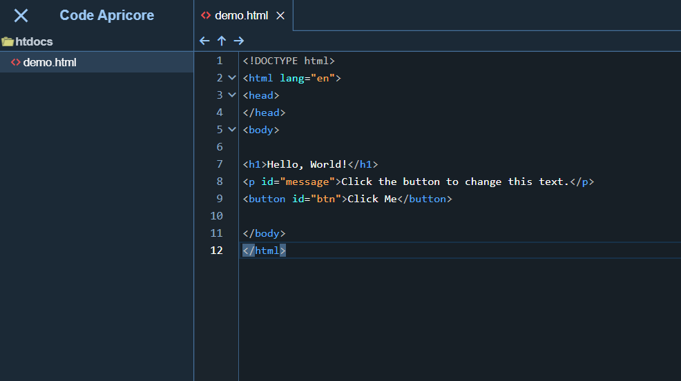

- **`Ctrl-P` or click the eye icon to open preview:**  
  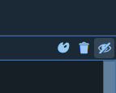
  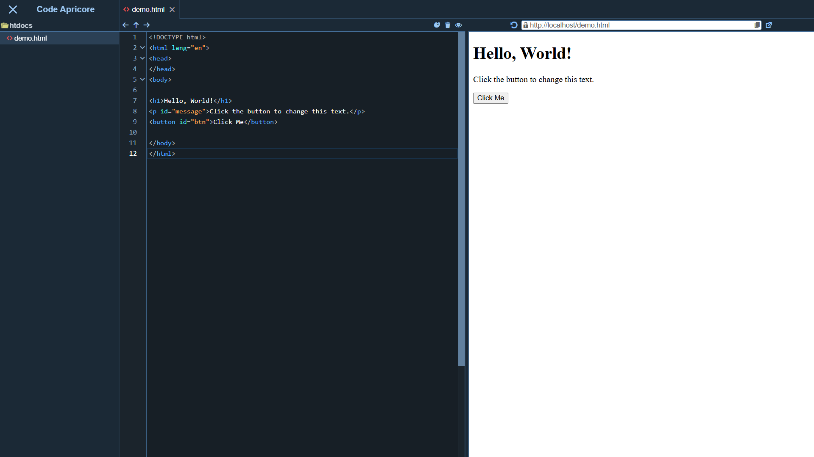
  
- **`Ctrl-J` or click the pallet icon to toggle theme:**  
  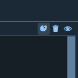
  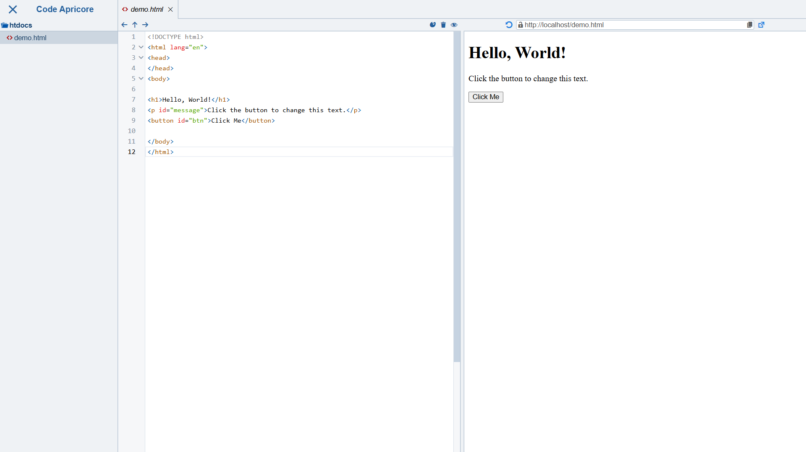
  
- **`Ctrl-L` or click the lock icon to pin the current iframe**:  
  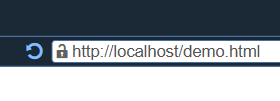  
  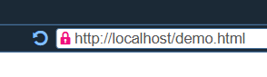
  
- **Excute javascript file:**
  1. Create a .js file:  
  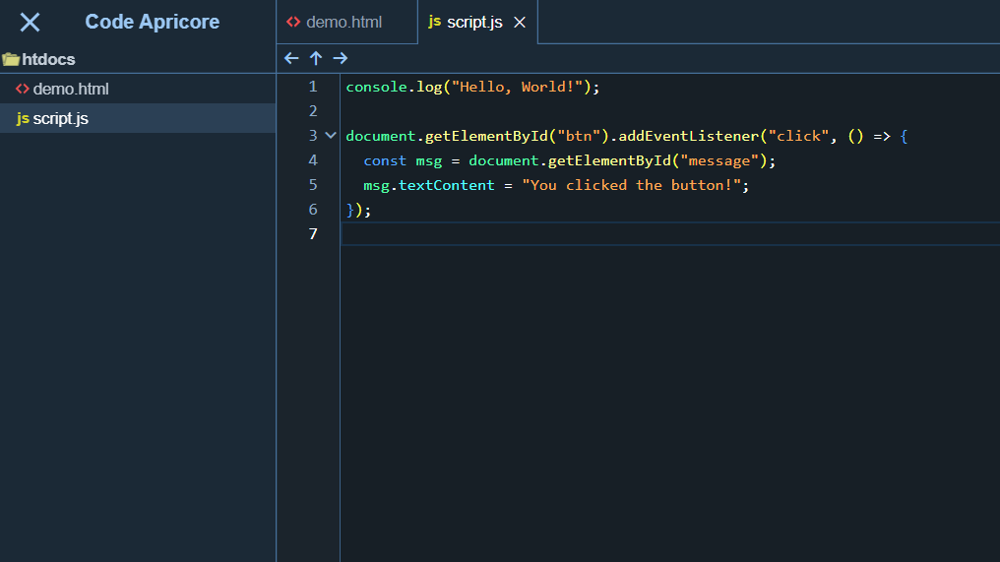
  2. Edit html file to include the javascript file:  
  

- **`Ctrl-Shif-I` to open Developer tools:**  
  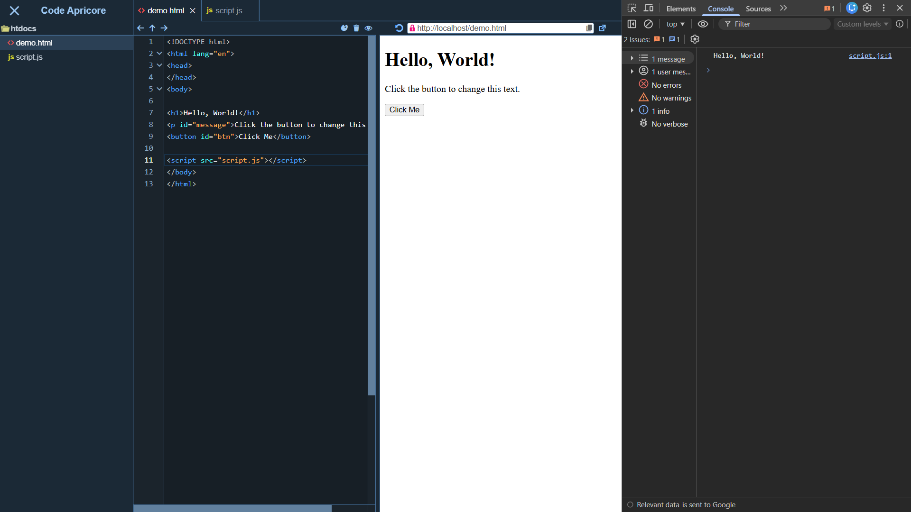
  
- **`Ctrl-R` or click the refresh icon to refresh iframe:**  
  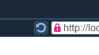

- **`Ctrl-O` or click the popout icon to open the page in a new tab:**  
  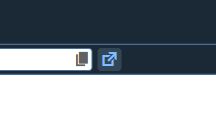
   
- **Click the popin icon to brings the page back into the main window:**  
  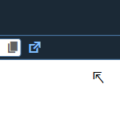

- **`Ctrl-H` or click the close icon to hide the current editor:**  
  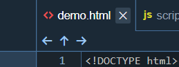

- **`Ctrl-Shift-H` or click the up icon to unhide the last editor that has be hidden:**  
  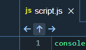

- **`Ctrl-K` or click the trash icon to drop the current editor:**  
  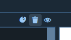

- **`Ctrl-↓` or click the right icon to move forward:**  
  
  
- **`Ctrl-↑` or click the left icon to move backward:**  
  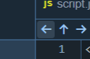
  
- **`Ctrl-M` to toggle the mini map:**
  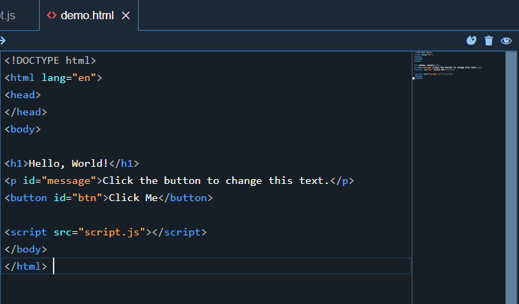
  
- **`Ctrl-B` to toggle file tree:**
  - Click the cross icon to hide the file tree:  
  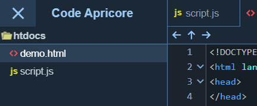
  - Click the cross icon to show the file tree:  
  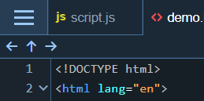
  
- **Create folder (`Ctrl-Shift-N` if installed as an app):**  
  1. Right click the root folder and on the context menu click "New Folder":  
  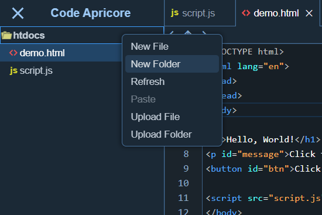
  2. Enter a folder name and press the Enter key:  
  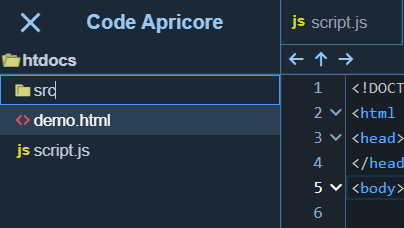
  
- **`Ctrl-Click` to select multiple files:**  
  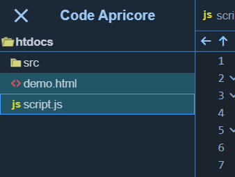
  
- **`Ctrl-C` or click copy on the context menu to copy the selected files:**  
  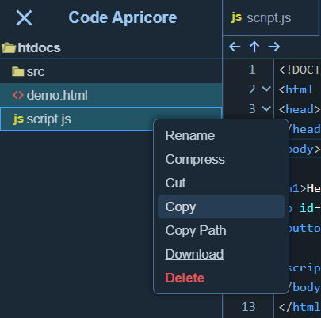
  
  
- **`Ctrl-V` or click past on the context menu to paste the copied files:**  
  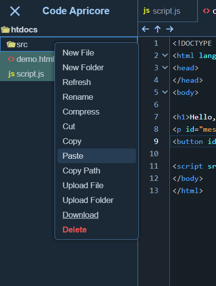
  
- **`Ctrl-A` to select all files in the current folder:**  
  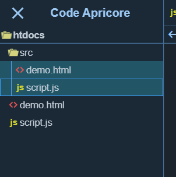
  
- **`Ctrl-X` or click cut on the context menu to cut all the selected files:**  
  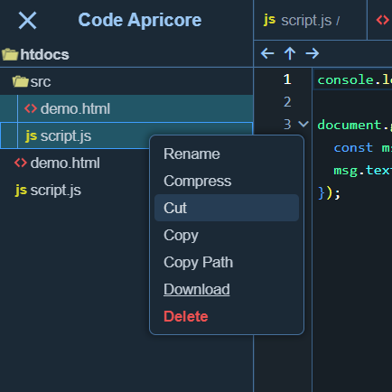
  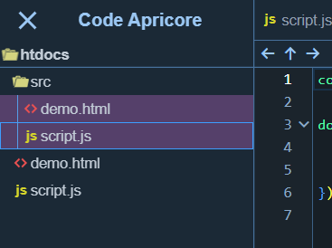
  
- **`Ctrl-Z` to turn cutted or copied files back to selected state, and selected files back to unselected state.**
  
- **`Ctrl-D` or click delete on the context menu to delete all the selected files:**  
  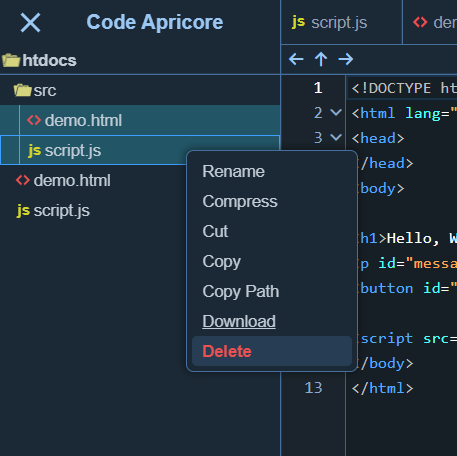
  
- **`Ctrl-Backtick` to toggle the embeded termial:**  
  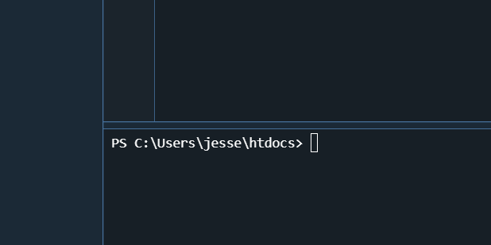

- **`Ctrl-R` to run or `Ctrl-Enter` to save and run supported programming languages:**
  - Execution of python files:
    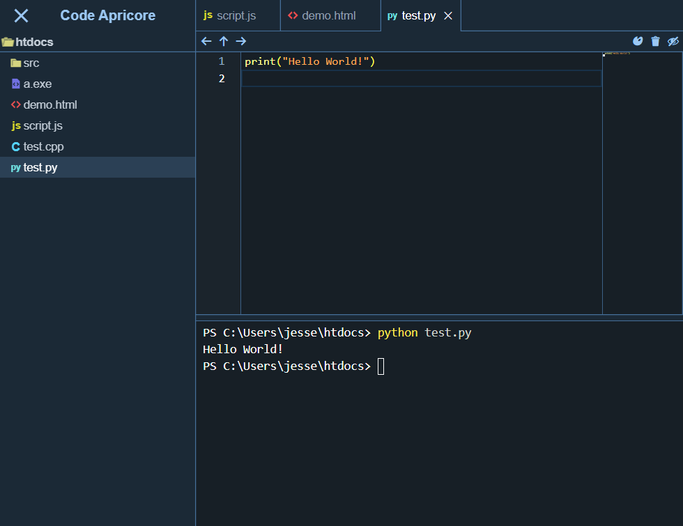
    When editing python file, every time when `Ctrl-R` or `Ctrl-Enter` is pressed, 
    the terminal will automatically run:
    ```bash
      python <path to the current python file>
    ```
  - Execution of java files:
    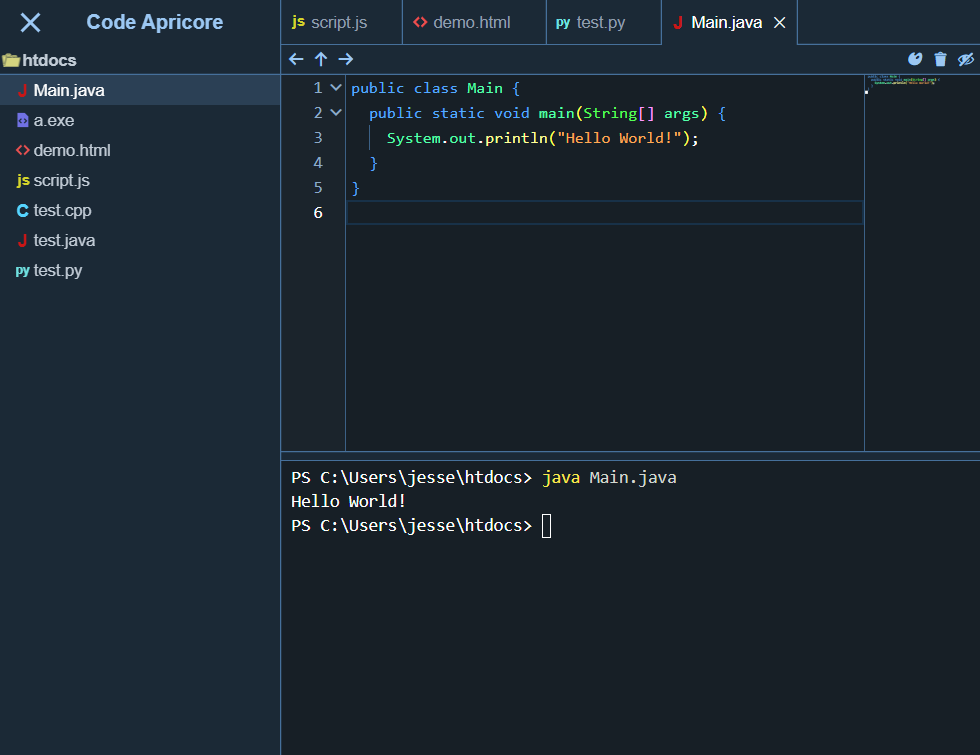
    When editing java file, every time when `Ctrl-R` or `Ctrl-Enter` is pressed, 
    the terminal will automatically run:  
      - If there is java file named Main.java (case insensitive) in the current java file's parent or ancestor directory, the closest main java file will be executed:
        ```bash
          java <path to the main java file>
        ```
      - Otherwise, the current java file will be executed:
        ```bash
          java <path to the current java file>
        ```
  - Compiling of C\C++ files:
    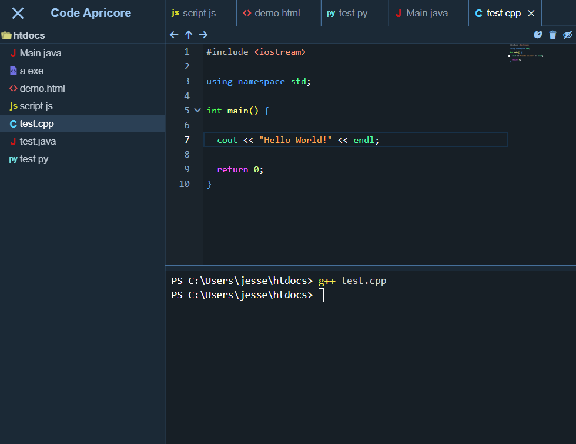
    - When editing C\C++ file, every time when `Ctrl-S` is pressed, 
      the terminal will automatically run:
      ```bash
        g++ <path to the current C\C++ file>
      ```
    - When editing .h file, every time when `Ctrl-S` is pressed and if there is C\C++ file named Main.cpp or Main.cpp (case insensitive) in the current C\C++ file's parent or ancestor directory, the closest main C\C++ file will be compiled:
      ```bash
        g++ <path to the main C\C++ file>
      ```

  - Execution of the compiled executable file:
    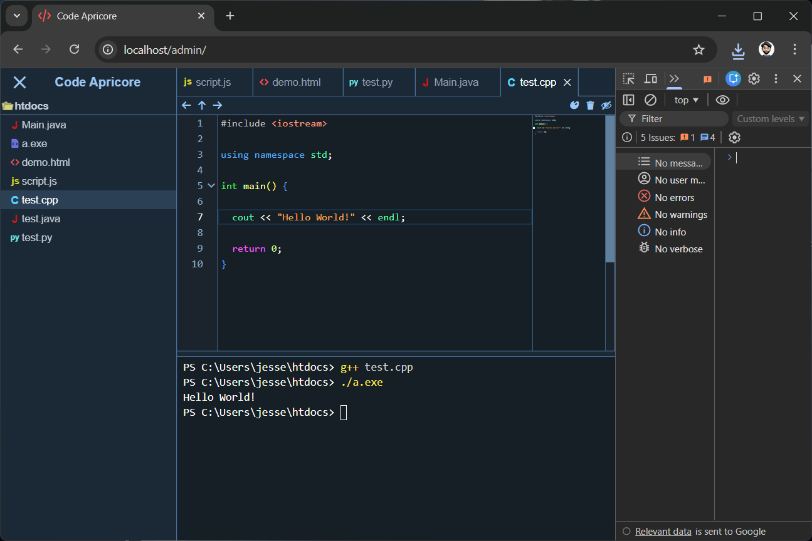
     When editing C\C++ file, every time when `Ctrl-R` is pressed, 
    the terminal will automatically run:
      - for windows:
        ```bash
          ./a.exe
        ```
      - for linux:
        ```bash
          ./a.out
        ```
  
- **`Ctrl-E` to clear terminal:**  
  `Ctrl-E` effectively run:
  ```bash
    clear
  ```
  Only when editing python, java and C\C++ files can `Ctrl-E` function.

- **`Ctrl-Q` to quit current running terminal process:**  
  `Ctrl-Q` have the same effect of pressing `Ctrl-C` in the terminal.  
  Only when editing python, java and C\C++ files can `Ctrl-Q` function.
